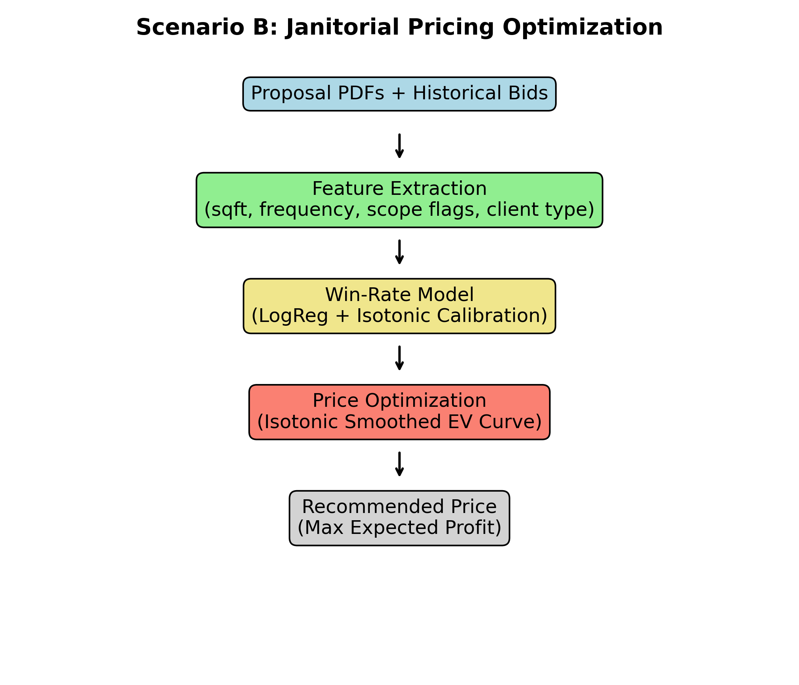
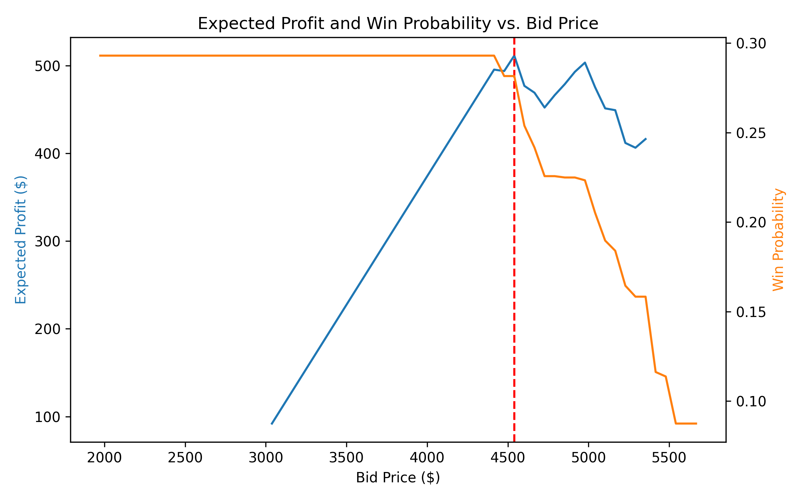

# Bid Pricing & Win-Rate Modeling

Commercial janitorial and day-porter services often operate in competitive bidding environments.
Pricing too high reduces win-rate, while pricing too low erodes profit margins.

This project explores how historical bid outcomes can guide predictive pricing.
I model the relationship between a proposal’s price and features and its probability of winning,
then optimize pricing to maximize expected profit while maintaining a minimum margin guardrail.

### Problem Framing

Service providers submit bids (mostly as unstructured PDFs) that include narrative text and cost estimates.
We assume access to ~10 years of historical bid data.
To demonstrate the concept, synthetic data was generated consisting of 1,200 bids with:

- **Structured features:** square footage (sqft), cost, client industry

- **Extracted text features:** cleaning frequency, and service scope (e.g., restrooms, kitchens, windows)

- **Price per square foot (ppsf)** and **bid outcome** (awarded / not awarded)

**Business Goal:**
Recommend a bid price that balances profitability and competitiveness.

**Success Metrics:**
- Improved expected profit and win-rate

- Model calibration (Brier Score)

- Ranking accuracy (ROC-AUC)

### Key Assumptions

- Pricing’s main influence on win probability is via price per sqft.

- Losing a bid has no direct financial cost (opportunity cost ignored).

- A 10% minimum margin constraint is enforced.

- All data are synthetic, designed to mimic realistic bidding behavior.

- Detailed assumptions and validation are in the notebook.

### Modeling Approach

**1) Feature Engineering**

- Continuous: price_per_sqft, log_sqft

- Categorical: one-hot encoded client industry & cleaning frequency

- Text-derived: Boolean service flags (restrooms, kitchen, windows, etc.)

- Regex-based extraction assumes OCR preprocessed PDFs

**2) Win-Rate Model**

- Logistic Regression with standardized inputs

- Isotonic Calibration applied post-modeling to improve probability reliability

- Evaluated using ROC-AUC (ranking ability) and Brier Score (probability accuracy)

**3) Expected Profit Optimization**

The expected value of profit for a proposed price (p) is:

$$
EV(p) = (p - c) \cdot P(\text{win} \mid p)
$$

subject to the minimum margin constraint:

$$
\frac{p - c}{p} \ge 0.10
$$

Where:

- $p$ = proposed bid price
- $c$ = operational delivery cost 
- $P(\text{win} \mid p)$ = calibrated probability of winning given bid price

The optimization grid-searches candidate prices and selects the one that maximizes expected profit while maintaining the margin floor.

### Results

**ROC-AUC:** Measures how well the model ranks winning bids above losing bids.
(0.87 indicates strong discrimination and realistic sensitivity to price)

**Brier Score:** Assesses how accurate probability predictions are (lower is better).
(~0.14 shows good calibration on synthetic data.)

**Isotonic Calibration:** Adjusts logistic regression probabilities to ensure monotonic, reliable win-rate curves — crucial for EV optimization.

A smooth **Expected Profit (EV)** curve typically rises sharply as bid prices increase above cost,
peaks at a balanced trade-off point where profit and win probability intersect,
then declines as higher prices lower the likelihood of winning.

In this run, the optimizer selected a large 30 000 sqft facility — a high-value but price-sensitive contract.
At the optimal bid price of $4,540, the model projects an expected profit of $511 with a 28% chance of winning.
This reflects a realistic dynamic for large commercial bids: fewer wins at higher prices, but each win contributes substantial profit.

From a previous run with a 11,500 sqft job, the optimal price was about $1,450, yielding $307 expected profit and a 50 % win rate — a balanced equilibrium between profit and competitiveness.

Together, these examples show how the model adapts to different contract sizes and competitive pressures.
The optimal point balances both forces — typically yielding moderate profit with a moderate (~50 %) win rate.

**How to Run**

Simply open the notebook and run all cells in order. All required libraries (e.g., numpy, pandas, scikit-learn, matplotlib) are imported within the notebook.
The notebook is self-contained and works in standard Python environments like Anaconda, Jupyter Notebook, or Google Colab.

*Tip:* The notebook uses built-in randomization for synthetic data, so your numbers may vary slightly on each run, but the overall behavior and trends will remain consistent.